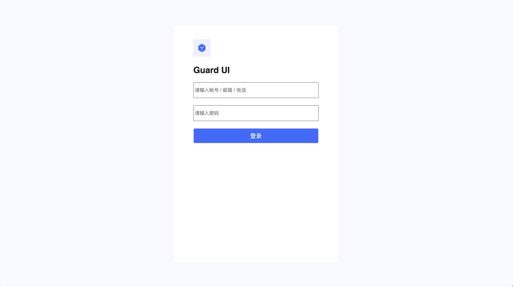

# Getting Started

In this tutorial, let's build a custom login page and see how Guard UI works. Open your favorite code editor and create index.html.

## Step 1: Init

```html
<script type="module">
    import { Guard } from 'https://unpkg.com/guard-ui/dist/index.mjs'
    const guard = await Guard.initialize({appId: "your authing app id"});
</script>
```

::: tip
Note that script is of type "module"
:::

## Step 2: Add component

```html
<g-guard>
    <g-guard-container>
        <g-app-logo></g-app-logo>
        <g-app-name></g-app-name>
        <g-account-input></g-account-input>
        <g-password-input></g-password-input>
        <g-error-text></g-error-text>
        <g-login-button></g-login-button>
    </g-guard-container>
</g-guard>
```

## Step 3: Handling result

```javascript
guard.on('login', (code, message, userInfo)=>{});
```

complete code:

```html
<html>
<body>
    <g-guard>
        <g-guard-container>
            <g-app-logo marginTop="24px" marginBottom="24px"></g-app-logo>
            <g-app-name marginBottom="20px"></g-app-name>
            <g-account-input marginBottom="20px" text=""></g-account-input>
            <g-password-input marginBottom="20px" text=""></g-password-input>
            <g-error-text marginTop="-15px" marginBottom="5px"></g-error-text>
            <g-login-button marginBottom="20px"></g-login-button>
        </g-guard-container>
    </g-guard>

    <script type="module">
        import { Guard } from 'https://unpkg.com/guard-ui/dist/index.mjs'

        const guard = await Guard.initialize({appId: "62ac18c93134e5fafcd29435"});
        guard.on('login', (code, message, userInfo) => {
            if (code === 200) {
                console.log(userInfo);
                guard.message.success('Welcome! ' + userInfo.nickname);
            } else {
                guard.message.error(message);
            }
        });
    </script>
</body>
</html>
```

::: tip
Replace appId with your own Authing app ID
:::

## Run

If you try to load the HTML file locally (i.e. with a file:// URL), you'll run into CORS errors due to JavaScript module security requirements. You need to do your testing through a server. If you are using vscode, you can install an extension called [Live Server](https://marketplace.visualstudio.com/items?itemName=ritwickdey.LiveServer).

with code above, your browser should show:



🎉 Congratulations! you have built a working login page.